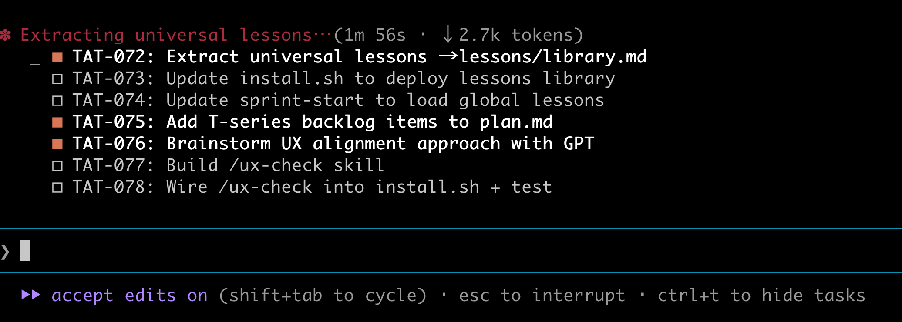
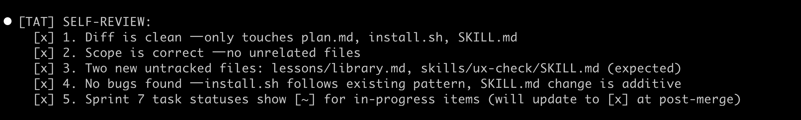

# My AI Team Has Four Models and One Human in the Loop

Last week, GPT found a security bug in code that Claude wrote.

Not a hypothetical. Not a contrived test. A real conversation-ownership vulnerability in a production app — if you started a chat, someone else could read your messages. Claude wrote the code. Claude reviewed the code. Claude missed it. GPT caught it in seconds.

That moment changed how I think about AI-assisted development.

---

## The Single-Model Trap

We all have a favorite model. Maybe it's Claude for reasoning, GPT for breadth, or whatever ships fastest. But here's the thing — every model has blind spots. And if you only use one model, you inherit all of its blind spots as your own.

I've been building a workflow called TAT (Tiny AI Team) that treats AI models like an engineering team. Not one genius doing everything, but specialists collaborating — with me as the product owner making the final calls:

- **Claude Opus** orchestrates. Plans epics, breaks work into sprints, makes architectural decisions, reviews the big picture.
- **Claude Sonnet** codes. Opus spawns Sonnet as a subagent for implementation tasks. Fast, focused, stays in scope.
- **GPT** reviews code. After Claude self-reviews its own diff, GPT gets a second look. Independent eyes on the same code.
- **GPT-mini** brainstorms. Cheap, fast, good for idea generation where you want volume over precision.
- **Me.** I approve plans, make product decisions, and have the final say on every merge.

Each model has a role. No model does everything. And it's not just better — it's dramatically cheaper.

Before TAT, I was burning through my daily Opus limit trying to do everything with one model. Now Opus only handles what it's good at — planning and orchestration. Routine coding goes to Sonnet. Brainstorming goes to GPT-mini. The expensive model only runs when it matters. Same output quality, fraction of the cost.

---

## When GPT Caught What Claude Missed

The Supabase incident was eye-opening.

I was building an AI concierge app. The database layer used Supabase, and I assumed the service role key had to be a JWT starting with `eyJ` — because that's what I'd always seen. Turns out Supabase changed their format to `sb_secret_...` and I wasted time questioning a perfectly valid key.

Claude didn't flag this. It shared my assumption.

GPT, looking at the same context independently, said: *"Don't assume key formats. Test the connection instead."*

Different training data. Different blind spots. That's the whole point.

In the same sprint, **Codex** (OpenAI's code-specialized model) caught the conversation ownership bug during code review. The endpoint let any user read any conversation — no ownership check. Claude's self-review walked right past it. Codex flagged it as a blocker.

Meanwhile, when I tried using gpt-4o-mini for code reviews, it produced false positives. It flagged things that weren't actually wrong. The cheaper model wasn't just worse — it was counterproductive for that task.

The lesson was clear: **use the right model for the right job.** Codex for code review. Opus for planning. Mini for brainstorming where precision doesn't matter as much.

---

## Three-Round Brainstorming

This is where the multi-model approach gets interesting.

TAT has a brainstorming skill that runs three rounds. In round one, GPT thinks independently — no bias from what Claude already decided. It generates ideas from scratch. In round two, Opus critiques GPT's ideas. Agrees, disagrees, adds what GPT missed. In round three, I decide what to keep.

The independence matters. If you just ask one model to brainstorm and then critique itself, you get confirmation bias. Two different models, thinking separately, surface things neither would alone.

---

## Lessons That Compound

Here's what surprised me most: lessons compound.

When GPT catches a bug in one project, that lesson gets captured. *"Run code review after every task — Codex caught a security bug that self-review missed."* When a shell script fails silently because of `grep + set -e`, that becomes a rule: *"Always add `|| true` to greps that might not match."*

These aren't just notes in a file. TAT has a **global lessons library** that gets loaded at the start of every sprint, in every project. What you learn building a real estate app shows up as a constraint when you start building a developer tool.

Fifteen universal lessons, earned the hard way across three projects, automatically informing every future sprint. Each project makes the next one better.

---

## Process Makes It Work

But models alone aren't enough. You need process.

TAT runs sprint ceremonies — a sprint-start gate that loads your spec, decisions, and lessons before you write a line of code. A sprint-end retro that captures what shipped, what slipped, and why. Between them, every task goes through a checkpoint sequence: **Plan, Code, Review, Ship.**

*Multiple agents running in parallel — Opus orchestrating while Sonnet subagents code*

The Review checkpoint is strict. Claude self-reviews the diff first — checks scope, looks for bugs, fixes what it finds. Then GPT reviews independently. Both results go to the user.

*The self-review gate: scope check, bug check, no untracked files — all before GPT even looks at it*

Git hooks enforce the rest. Conventional commit format. No direct pushes to main. Branch protection requiring PRs. These aren't suggestions — the hooks will reject your commit if you try to skip them.

It sounds heavy. It's not. The checkpoints take seconds. And they catch things. Every. Single. Sprint.

---

## TAT Builds Itself

The part I enjoy most: TAT builds itself.

The workflow that manages sprints, reviews code, captures lessons, and enforces gates — that workflow was built using its own process. Sprint 1 created the foundation. Sprint 2 added GPT integration. Sprint 3 built the brainstorming and article skills. By Sprint 7, TAT was consolidating lessons from other projects back into itself.

Each sprint makes the system smarter. The lessons library grew from zero to fifteen entries. The review gates went from optional to mandatory. The parallel agent support means multiple tasks run simultaneously while Opus keeps orchestrating.

---

## This Article Was Written, Reviewed, and Published by TAT

One more thing. This article was created using TAT itself.

TAT's `/article` skill scaffolded the folder structure, created the spec, and generated the draft. I reviewed it, left inline comments, and TAT revised it. After my approval, TAT committed the article, pushed the branch, and created the PR. The screenshots you see were taken during the same sprint that built the features being described.

I'm the one human in the loop — and that's exactly how it should be. AI does the heavy lifting. I make the decisions.

---

## Try It

TAT is open source. It's a set of Claude Code skills, shell scripts, and markdown files — no framework, no database, no dependencies beyond Claude Code and an OpenAI API key.

If you're using AI to write code and you've ever thought *"I wish it would catch its own mistakes"* — try giving it a colleague. A different model, with different training, looking at the same code.

You might be surprised what it sees.

**[github.com/farshi/tinyaiteam](https://github.com/farshi/tinyaiteam)**
